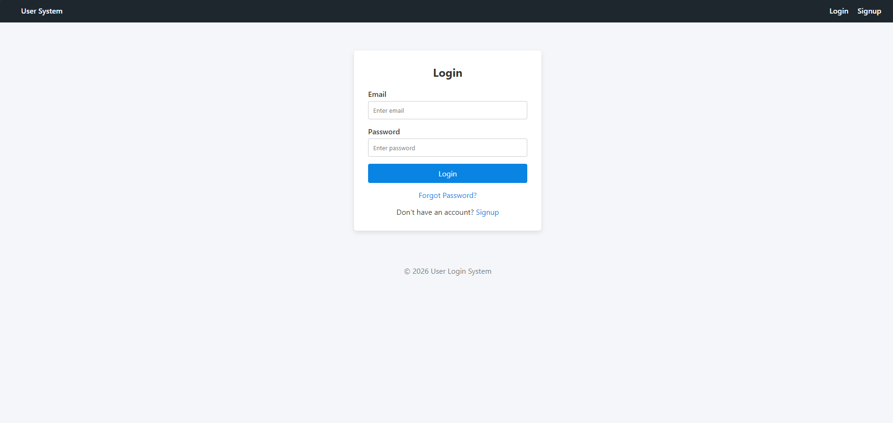
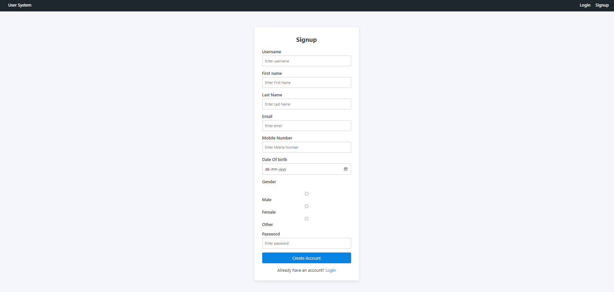
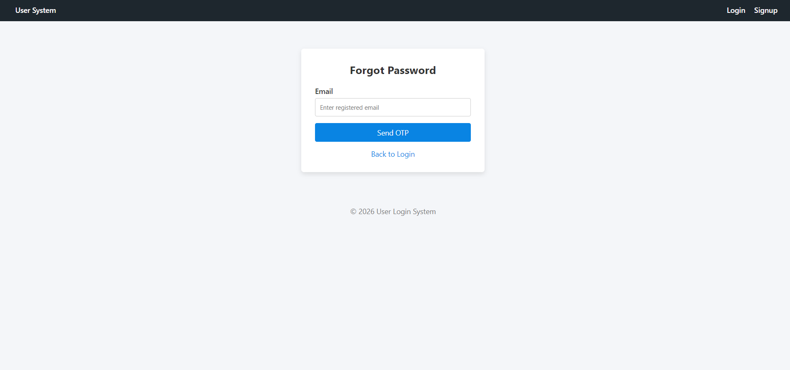
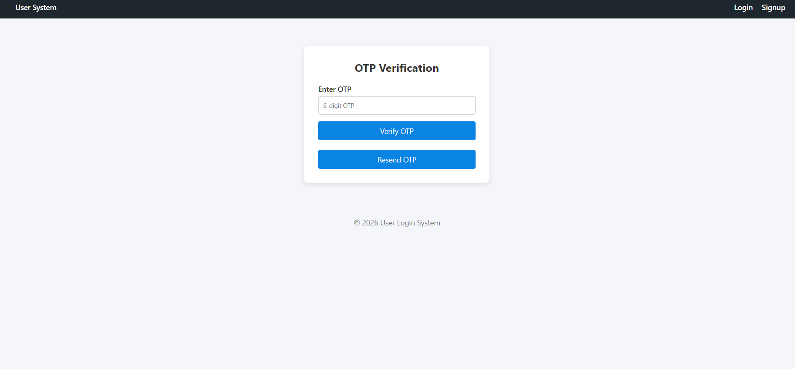
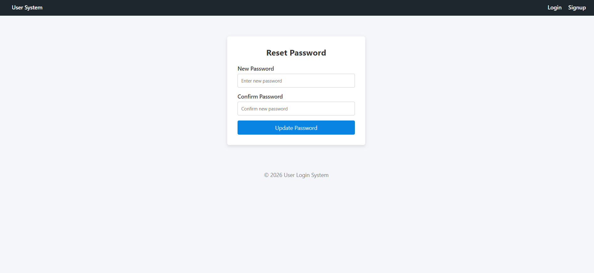
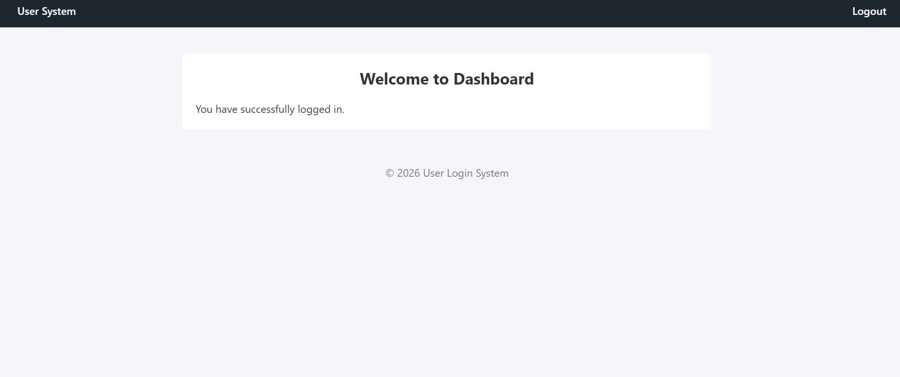
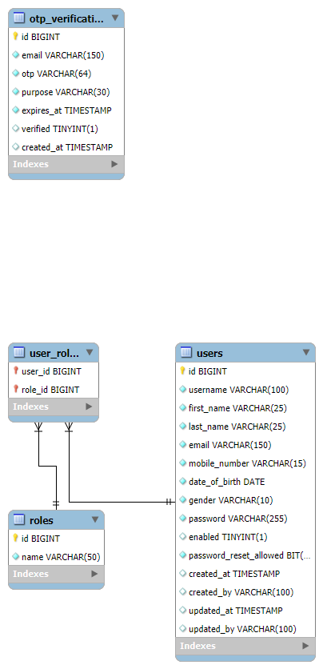

# User Login & Registration System

A secure authentication system built using Spring Boot and Spring Security.

This project demonstrates secure authentication system design with email verification, OTP-based password reset, encrypted password storage, and role-based authorization.

---

## 🚀 Tech Stack

- Java
- Spring Boot
- Spring Security
- Spring Data JPA
- MySQL
- Thymeleaf
- HTML, CSS
- BCrypt Password Encoder

---

## ✨ Features

### 🔐 Authentication
- User Registration
- Email verification during registration
- Account activation using verification link
- Secure Login & Logout
- Role-based Authentication (ROLE_USER, ROLE_ADMIN)
- Session Management using Spring Security

### 🔑 Password Security
- Password encryption using BCrypt
- OTP-based Signup and Forgot Password flow
- OTP expiration (5 minutes)
- Reset password with confirmation validation
- Inactive account restriction before email verification

### ⚠ Validation & Error Handling
- Invalid login credentials handling
- Invalid OTP handling
- OTP expiration validation
- Password mismatch detection
- Success & error alert messages

---

## 🔄 Authentication Flow

1. User registers with required details.
2. Verification email is sent to activate the account.
3. Account remains inactive until verified.
4. Password is encrypted using BCrypt before storing in database.
5. User logs in using credentials.
6. If password is forgotten:
   - User requests OTP.
   - OTP is sent to registered email.
   - OTP is verified.
   - User resets password securely.
7. User is redirected to dashboard after successful login.

---

## 🧠 Architecture

Controller → Service → Repository → Database

- Controllers handle HTTP requests.
- Service layer contains business logic.
- Repository layer interacts with database.
- Spring Security manages authentication and session control.

---

## 🗄 Database Design

The system uses MySQL with normalized relational structure.

### Tables Overview

**users**
- Stores user profile details
- Encrypted password using BCrypt
- `enabled` flag for email verification
- Audit fields: created_at, updated_at

**roles**
- Stores system roles (ROLE_USER, ROLE_ADMIN)

**user_roles**
- Many-to-many mapping between users and roles

**otp_verification**
- Stores OTP for registration and password reset
- Includes expiration time
- Supports purpose-based validation
- Prevents OTP reuse using verified flag

---

## 📌 Core Endpoints

| Method | Endpoint | Description |
|--------|----------|------------|
| POST | /signup | Register new user |
| POST | /login | Authenticate user |
| POST | /forgot-password | Send OTP to email |
| POST | /verify-otp | Verify OTP |
| POST | /reset-password | Update user password |

---

## 🛡 Security Implementation

- BCrypt password hashing
- Spring Security configuration
- Role-based access control
- Session-based authentication
- OTP expiration logic
- Email verification token validation
- Account activation control using `enabled` flag

---

## 📸 Screenshots

### Login Page


### Signup Page


### Forgot Password


### OTP Verification


### Reset Password


### Dashboard


### ER Diagram


---

## ⚙ How to Run Locally

1. Clone the repository:
   ```bash
   git clone https://github.com/Rayavarapu-Mahendra/Rayavarapu-Mahendra-User-Login-Registration-Mini
   ```

2. Configure MySQL in `application.properties`:
   ```properties
   spring.datasource.url=jdbc:mysql://localhost:3306/ulrs
   spring.datasource.username=root
   spring.datasource.password=your_password
   ```

3. Run the application:
   ```bash
   mvn spring-boot:run
   ```

4. Open browser:
   ```
   http://localhost:8010
   ```

---

## 📈 Future Enhancements

- JWT-based authentication (stateless security)
- Swagger API documentation
- Account lock after multiple failed attempts
- Deployment to cloud platform

---

## 👨‍💻 Author

**Rayavarapu Mahendra**

Java Backend Developer  
Spring Boot | REST APIs | MySQL | Spring Security  

LinkedIn: https://www.linkedin.com/in/rayavarapu-mahendra/
GitHub: https://github.com/Rayavarapu-Mahendra/
